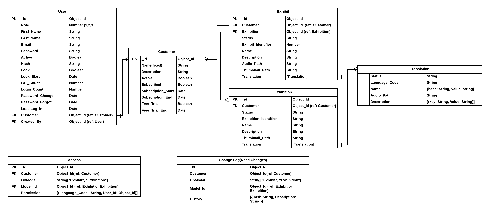

# GUIDEXP ADMIN SYSTEM

## Development Tools

1. Front End

- ReactJS + Ant Design for UI components

2. Back End

- Node (Javascript Runtime)

- Express.js (Web framework)

- MongoDB (Database)

## Backend Setup

- Make sure you have nodejs and MongoDB installed on your local envirnoment.

- Run `npm i` in the root directory to install required packages.

- Create a .env file in the root directory and copy everything inside .env-template into .env. Then fill out .env.

- Run `node app.js` to run the backend.

## Frontend Setup

- Run `npm i` in the `./client` directory.

- Run `npm start` to start the frontend.

## Database Design

- https://app.lucidchart.com/documents/view/74dc46a3-9369-4b2e-a337-6eb3b2eb0668

## API Endpoints

There are four endpoints top level domains, which are, auth, user, exhibit, and public. 

The followings describe the APIs for the admin system, excluding the public domain which serves the frontend. 

- auth's APIs

| Route                  | HTTP Method   |Permission     |req.body            |res            | 
| ---------------------  |:-------------:|:-------------:|:-----------------: |:-------------:|
| /auth/login            | POST          | ALL           | {email, password}  |               |
| /auth/forget           | POST          | ALL           | {email}            |               | 
| /auth/reset/:userId    | GET           | ALL           |                    |               |
| /auth/reset/:userId    | POST          | ALL           | {token, password}  |               | 
| /auth/activate/:userId | POST          | ALL           | {token}            |               | 
